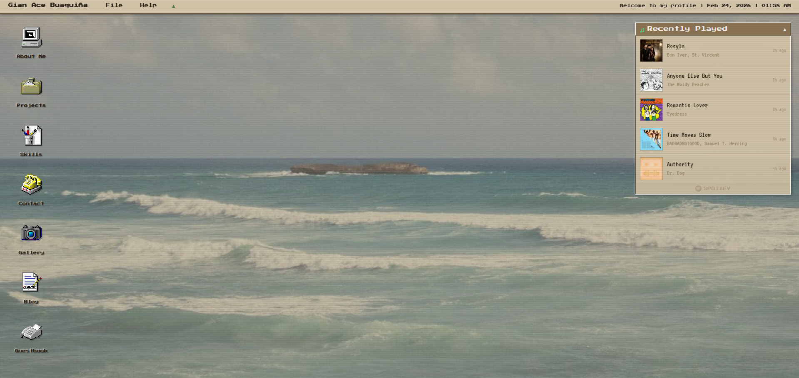

# Retro Desktop Portfolio

A nostalgic Windows 95-inspired portfolio website with a working desktop environment, draggable windows, and real-time Spotify integration.



## ✨ Features

- **Retro Desktop UI** - Authentic Windows 95 aesthetic with pixelated fonts and classic window chrome
- **Draggable Windows** - Fully interactive windows with minimize, maximize, and close functionality
- **Desktop Icons** - Click to launch different sections (About, Projects, Skills, Contact, Gallery, Blog, Guestbook)
- **Spotify Widget** - Real-time display of your recently played tracks with album art
- **Responsive Design** - Mobile-friendly layout that adapts to smaller screens
- **Keyboard Shortcuts** - Press `ESC` to close the active window
- **Window Management** - Proper z-index stacking, focus handling, and minimize functionality

## 🛠️ Tech Stack

- **Frontend:** React 18, Vite 6
- **Styling:** Tailwind CSS with custom retro theme
- **Backend:** Vercel Serverless Functions
- **APIs:** Spotify Web API
- **Deployment:** Vercel
- **Font:** VT323, Press Start 2P

## 📦 Installation

1. **Clone the repository**
   ```bash
   git clone https://github.com/yourusername/your-repo-name.git
   cd your-repo-name
   ```

2. **Install dependencies**
   ```bash
   npm install
   ```

3. **Set up environment variables**
   
   Create a `.env` file in the root directory:
   ```env
   SPOTIFY_CLIENT_ID=your_spotify_client_id
   SPOTIFY_CLIENT_SECRET=your_spotify_client_secret
   SPOTIFY_REFRESH_TOKEN=your_spotify_refresh_token
   ```

## 🎵 Spotify Setup

To display your recently played tracks, you need to set up Spotify API credentials:

### 1. Create a Spotify App

- Go to [Spotify Developer Dashboard](https://developer.spotify.com/dashboard)
- Click **Create App**
- Fill in the details:
  - **App Name:** Your Portfolio
  - **Redirect URI:** `http://127.0.0.1:3000/callback`
  - **Which API/SDKs:** Web API
- Save your **Client ID** and **Client Secret**

### 2. Get a Refresh Token

**Step 1:** Visit this URL in your browser (replace `YOUR_CLIENT_ID`):
```
https://accounts.spotify.com/authorize?client_id=YOUR_CLIENT_ID&response_type=code&redirect_uri=http://127.0.0.1:3000/callback&scope=user-read-recently-played
```

**Step 2:** After authorizing, copy the `code` from the URL (e.g., `http://127.0.0.1:3000/callback?code=XXXXXX`)

**Step 3:** Run this in PowerShell (replace placeholders):
```powershell
$clientId = "YOUR_CLIENT_ID"
$clientSecret = "YOUR_CLIENT_SECRET"
$authCode = "PASTE_CODE_HERE"

$body = @{
    grant_type   = "authorization_code"
    code         = $authCode
    redirect_uri = "http://127.0.0.1:3000/callback"
}
$auth = [Convert]::ToBase64String([Text.Encoding]::UTF8.GetBytes("${clientId}:${clientSecret}"))
$headers = @{
    Authorization = "Basic $auth"
    "Content-Type" = "application/x-www-form-urlencoded"
}
$response = Invoke-RestMethod -Uri "https://accounts.spotify.com/api/token" -Method Post -Body $body -Headers $headers
$response.refresh_token
```

**Step 4:** Copy the `refresh_token` and add it to your `.env` file.

## 🚀 Development

### Run with Vercel CLI (supports serverless functions)
```bash
npm install -g vercel
vercel dev
```

Visit [http://localhost:3000](http://localhost:3000)

### Run with Vite (frontend only, no Spotify widget)
```bash
npm run dev
```

## 📁 Project Structure

```
├── api/
│   └── spotify.js              # Vercel serverless function for Spotify API
├── public/
│   └── images/                 # Static assets
├── src/
│   ├── components/
│   │   ├── Desktop.jsx         # Main desktop layout
│   │   ├── DesktopIcon.jsx     # Desktop icon component
│   │   ├── MenuBar.jsx         # Top menu bar
│   │   ├── MobileLayout.jsx    # Mobile-optimized layout
│   │   ├── SpotifyWidget.jsx   # Recently played Spotify tracks
│   │   ├── Window.jsx          # Draggable window component
│   │   └── windows/            # Window content components
│   ├── hooks/
│   │   ├── useDrag.js          # Drag functionality
│   │   ├── useIsMobile.js      # Mobile detection
│   │   └── useWindowManager.js # Window state management
│   ├── App.jsx
│   ├── main.jsx
│   └── index.css               # Global styles & retro theme
├── .env                        # Environment variables (not in git)
├── .env.example                # Template for environment variables
├── vercel.json                 # Vercel configuration
└── package.json
```

## 🌐 Deployment

### Deploy to Vercel

1. **Push to GitHub**
   ```bash
   git add .
   git commit -m "Initial commit"
   git push origin main
   ```

2. **Connect to Vercel**
   - Go to [vercel.com](https://vercel.com)
   - Import your GitHub repository
   - Vercel will auto-detect Vite settings

3. **Add Environment Variables**
   - Go to **Settings → Environment Variables**
   - Add:
     - `SPOTIFY_CLIENT_ID`
     - `SPOTIFY_CLIENT_SECRET`
     - `SPOTIFY_REFRESH_TOKEN`

4. **Deploy**
   - Vercel will automatically deploy on every push to `main`

## 🎨 Customization

### Colors
Edit the Tailwind theme in `tailwind.config.js`:
```js
colors: {
  retro: {
    beige: '#d4c5a9',
    light: '#e8ddd4',
    dark: '#8b7355',
    // ...
  }
}
```

### Window Content
Add new windows by:
1. Creating a component in `src/components/windows/`
2. Adding it to `Desktop.jsx`'s `windowConfigs` and `contentMap`
3. Adding an icon to the `icons` array

### Desktop Background
Replace `public/images/background.jpg` with your own image.

## 📝 License

MIT License - feel free to use this project for your own portfolio!

## 🙏 Acknowledgments

- Retro design inspired by Windows 95
- Font: [VT323](https://fonts.google.com/specimen/VT323) by Peter Hull
- Icons: Custom pixel art

---

**Made with ♥ by Gian Ace Buaquiña**
